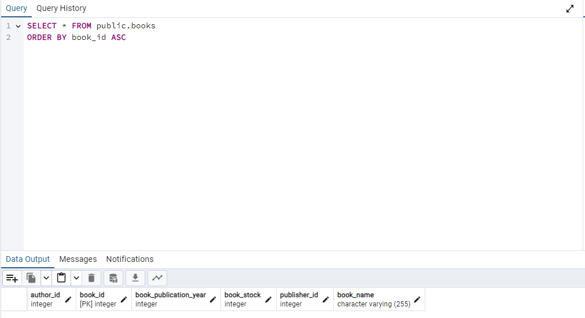
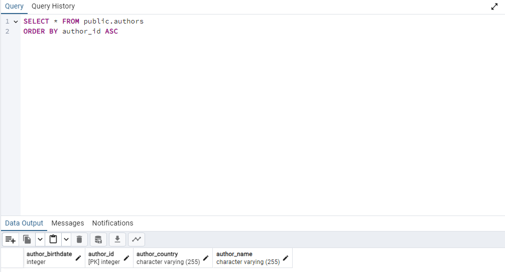

# Library Managment

Bu proje, bir kütüphane yönetim sistemi için Java ve PostgreSQL kullanılarak geliştirilmiştir.

## Proje Yapısı

Proje Maven projesi olarak yapılandırılmıştır. İlgili bağımlılıklar `pom.xml` dosyasında tanımlanmıştır.

## Kullanılan Teknolojiler

- Java
- Maven
- PostgreSQL
- Hibernate ORM

## Veritabanı Yapısı

Proje aşağıdaki entity (varlık) sınıflarını içermektedir:

- Book

- Author

- Category

- Publisher

- BookBorrowing

## Nasıl Çalıştırılır

1. **Veritabanı Kurulumu**: PostgreSQL veritabanında `library_management` adında bir veritabanı oluşturun.

2. **Bağımlılıkların İndirilmesi**: Maven ile proje bağımlılıklarını indirin: `mvn clean install`.

3. **Uygulamanın Çalıştırılması**: Uygulamayı çalıştırın ve localhost üzerinde çalışan bir sunucu oluşturun.

Bu proje açık kaynaklıdır ve katkılara açıktır. Her türlü katkı ve geri bildirimlerinizi bekliyoruz.
